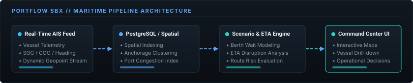
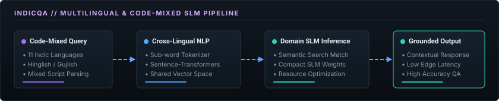
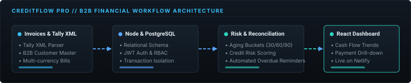

<div align="center">

<!-- Hero Command Center Header -->
<a href="https://github.com/ommistry223">
  
</a>

<br/>

<!-- Quick Action Badges -->
<p align="center">
  <a href="mailto:ommistry5559@gmail.com">
    
  </a>
  <a href="https://github.com/ommistry223">
    
  </a>
  <a href="https://github.com/ommistry223?tab=repositories">
    
  </a>
  
</p>

<!-- Quick Navigation Bar -->
<p align="center">
  <code><a href="#about-me">ABOUT</a></code> &nbsp;·&nbsp;
  <code><a href="#engineering-snapshot">SNAPSHOT</a></code> &nbsp;·&nbsp;
  <code><a href="#featured-projects">PROJECTS</a></code> &nbsp;·&nbsp;
  <code><a href="#tech-stack">TECH STACK</a></code> &nbsp;·&nbsp;
  <code><a href="#developer-telemetry">TELEMETRY</a></code> &nbsp;·&nbsp;
  <code><a href="#github-activity">ACTIVITY</a></code> &nbsp;·&nbsp;
  <code><a href="#lets-connect">CONNECT</a></code>
</p>

</div>

---

<a id="about-me"></a>
## 👨‍💻 About Me

I'm a **third-year Computer Engineering undergraduate at CHARUSAT** focused on building practical, full-stack web applications and exploring applied machine learning and natural language processing.

My engineering work centers on building complete systems end-to-end: designing responsive frontend interfaces, writing modular backend APIs, architecting relational database schemas, and experimenting with domain-specific AI/NLP pipelines. Rather than just consuming tutorials, I prioritize understanding system internals through real implementation, debugging, and continuous iteration.

<table>
<tr>
<td width="34%" valign="top">

### 🚀 Currently Building
- **Maritime Intelligence**: AIS telemetry processing, spatial vessel clustering, and congestion simulation (**PortFlow SBX**).
- **Multilingual NLP**: Question-answering systems across 11 Indic languages and code-mixed inputs (**IndicQA**).
- **Enterprise Web Apps**: B2B credit and cash-flow management with Tally XML ledger ingestion (**CreditFlow Pro**).

</td>
<td width="33%" valign="top">

### 🧠 Currently Learning
- **NLP & Language Models**: Tokenization strategies, cross-lingual sentence embeddings, and Small Language Models (SLMs).
- **System Design & Databases**: Relational normalization, indexing strategies, and connection pooling in PostgreSQL.
- **Data Structures & Algorithms**: Algorithmic problem solving in C++ and Java.

</td>
<td width="33%" valign="top">

### ⚙️ Engineering Principles
- **End-to-End Ownership**: From schema design to deployment and UX.
- **Pragmatic Craftsmanship**: Clean abstractions, readable code, and honest technical metrics.
- **Iteration Rhythm**:
  ```text
  Build ➔ Learn ➔ Improve ➔ Repeat
  ```

</td>
</tr>
</table>

---

<a id="engineering-snapshot"></a>
## 📐 Engineering Snapshot

A structured overview of core proficiencies across the application lifecycle:

```text
┌─────────────────────────┬─────────────────────────────────────────────────────────────┐
│ LAYER                   │ TECHNOLOGIES & COMPETENCIES                                 │
├─────────────────────────┼─────────────────────────────────────────────────────────────┤
│ Frontend Engineering    │ React · Next.js · TypeScript · Tailwind CSS · Vite · HTML5  │
│ Backend Architecture    │ Node.js · Express · RESTful APIs · JWT Auth · Middleware    │
│ Databases & Storage     │ PostgreSQL · MySQL · Supabase · Prisma ORM · SQL Indexing   │
│ AI / ML & NLP           │ Python · scikit-learn · Sentence-Transformers · SLMs · NLP  │
│ Systems & Languages     │ C · C++ · Java · Python · JavaScript · TypeScript · SQL     │
│ Tooling & Platforms     │ Git · GitHub · Docker · Linux/Bash · Vercel · Netlify       │
└─────────────────────────┴─────────────────────────────────────────────────────────────┘
```

---

<a id="featured-projects"></a>
## 🚀 Featured Projects

Deep-dive showcase of systems built to solve real-world problems.

### 1. ⚓ PortFlow SBX — Maritime Operational Intelligence Platform
> **Real-time AIS vessel telemetry, geospatial congestion intelligence, and operational decision support.**

<p align="center">
  
</p>

- **Problem**: Maritime ports and terminal operators face unpredictable vessel queues, costly anchorage delays, and fragmented situational awareness during peak shipping windows.
- **Architecture & Implementation**:
  - **Live AIS Telemetry Ingestion**: Ingests vessel spatial streams including MMSI identifiers, Speed Over Ground (SOG), Course Over Ground (COG), and dynamic geographic coordinates.
  - **Spatial Congestion Indexer**: Uses **PostgreSQL** with spatial queries to detect anchorage clustering, calculate turnaround times, and compute real-time port congestion scores.
  - **Scenario & Routing Simulation**: Evaluates berth wait queues and models ETA disruptions to provide actionable operational recommendations.
  - **Command Center Dashboard**: Responsive map-based operational interface with vessel drill-downs, live telemetry filtering, and alert thresholds.
- **Tech Stack**: `React` · `Next.js` · `PostgreSQL` · `Node.js` · `Tailwind CSS` · `Geospatial Maps`

---

### 2. 🌍 IndicQA — Multilingual & Code-Mixed SLM Question Answering
> **Resource-efficient domain question-answering across 11 Indic languages and code-mixed conversations.**

<p align="center">
  
</p>

- **Problem**: Mainstream large language models often struggle with informal code-mixed text (such as Hinglish and Gujlish) and carry high deployment latency and prohibitive compute costs for domain-specific queries.
- **Architecture & Implementation**:
  - **Multilingual Tokenization & Preprocessing**: Handles script transliteration, normalization, and sub-word tokenization across 11 Indic languages and mixed-script inputs.
  - **Cross-Lingual Dense Retrieval**: Utilizes `Sentence-Transformers` to generate semantic embeddings within a shared vector space, mapping code-mixed user queries to relevant domain passages.
  - **Small Language Model (SLM) Inference**: Employs fine-tuned, parameter-efficient models to generate accurate, grounded responses without demanding multi-GPU cloud infrastructure.
  - **Low-Latency Edge Deployment**: Optimized for fast inference cycles on commodity hardware.
- **Tech Stack**: `Python` · `Sentence-Transformers` · `NLP` · `SLMs` · `scikit-learn` · `Semantic Search`

---

### 3. 💳 CreditFlow Pro (B2B) — Enterprise Cash-Flow & Credit Risk Suite
> **B2B financial workflow management platform with Tally XML ledger import, credit risk scoring, and invoice tracking.**

<p align="center">
  
</p>

<p align="left">
  <a href="https://github.com/ommistry223/B2B">
    
  </a>
  <a href="https://bto-b.netlify.app">
    
  </a>
</p>

- **Problem**: Small and medium B2B enterprises frequently face cash-flow bottlenecks due to unmonitored credit terms, delayed client follow-ups, and accounting software silos.
- **Architecture & Implementation**:
  - **Tally XML Parser Pipeline**: Extracts and normalizes customer balances, vouchers, and invoice details from traditional accounting exports into structured database records.
  - **Relational Ledger & RBAC**: Built on **PostgreSQL** and **Express/Node.js**, enforcing role-based permissions, multi-currency invoicing, and payment reconciliation.
  - **Receivables Aging Analysis**: Categorizes receivables into aging buckets (0–30, 31–60, 61–90+ days) and scores customer credit risk dynamically.
  - **Interactive Analytics UI**: Fast, responsive React + Vite interface with real-time payment drill-down and cash-flow visualizations.
- **Tech Stack**: `React` · `Vite` · `Tailwind CSS` · `Node.js` · `Express` · `PostgreSQL`

---

### 4. 📊 TRACKIFY — Full-Stack Expense Management & Financial Intelligence
> **Personal finance tracking platform built with Next.js, Prisma ORM, NextAuth, and dynamic analytics.**

<p align="left">
  <a href="https://github.com/ommistry223/TRACKIFY">
    
  </a>
</p>

- **Core Capabilities**:
  - End-to-end type safety across client and server with **TypeScript** and **Next.js App Router**.
  - Relational database schema with **Prisma ORM** managing users, categorized expenses, and recurring budgets.
  - Secure authentication and protected API endpoints via **NextAuth**.
  - Visual breakdown of financial health using interactive chart components and categorized transaction summaries.
- **Tech Stack**: `Next.js` · `React` · `TypeScript` · `Prisma` · `NextAuth` · `Tailwind CSS`

---

### 5. 🧱 Core Systems & Engineering Repositories

<table>
<tr>
<td width="50%" valign="top">

#### 🧾 Invoice Management System
Full-stack automated billing and invoicing platform with role-based access, automated notifications, and database reconciliation.
- **Stack**: `Next.js` · `Node.js` · `PostgreSQL` · `Tally XML`

</td>
<td width="50%" valign="top">

#### 🌐 Web Development Foundations
Comprehensive showcase of responsive web layouts, DOM manipulation, component patterns, and interactive frontend fundamentals.
- **Stack**: `HTML5` · `CSS3` · `JavaScript`
- **Repo**: [`ommistry223/Web-Dev`](https://github.com/ommistry223/Web-Dev) · **Demo**: [charusat-phi.vercel.app](https://charusat-phi.vercel.app)

</td>
</tr>
<tr>
<td width="50%" valign="top">

#### 🧩 Algorithmic C++ Engineering
Repository of practical implementations solving computational problems, object-oriented designs, templates, and memory-safe paradigms.
- **Stack**: `C++` · `OOP` · `Algorithms`
- **Repo**: [`ommistry223/CPP-PRACTICALS_24CE065`](https://github.com/ommistry223/CPP-PRACTICALS_24CE065)

</td>
<td width="50%" valign="top">

#### ☕ Java Practical Systems
Implementation of core computing concepts, OOP principles, exception architectures, and multi-threading models.
- **Stack**: `Java` · `OOP` · `Data Structures`
- **Repo**: [`ommistry223/Java`](https://github.com/ommistry223/Java)

</td>
</tr>
</table>

---

<a id="tech-stack"></a>
## 🧰 Tech Stack

Curated based on active, hands-on production and project usage:

### 💻 Languages
<p>
  
  
  
  
  
  
  
</p>

### 🌐 Frontend
<p>
  
  
  
  
  
  
</p>

### ⚙️ Backend & Databases
<p>
  
  
  
  
  
  
</p>

### 🤖 AI / ML & Data Science
<p>
  
  
  
  
  
</p>

### 🛠️ DevOps & Development Tools
<p>
  
  
  
  
  
  
</p>

---

<a id="developer-telemetry"></a>
## 🖥️ Developer Telemetry

Diagnostic snapshot inspected from active development systems:

<p align="center">
  
</p>

---

<a id="github-activity"></a>
## 📈 GitHub Activity

Telemetry monitoring public repository contributions, language distributions, and commit frequency.

<div align="center">

<!-- GitHub Stats & Top Languages -->
<a href="https://github.com/ommistry223">
  
</a>
<a href="https://github.com/ommistry223">
  
</a>

<br/><br/>

<!-- GitHub Activity Graph -->
<a href="https://github.com/ommistry223">
  
</a>

<br/><br/>

<!-- Contribution Snake -->


</div>

---

<a id="lets-connect"></a>
## 🤝 Let's Connect

I am always interested in discussing software engineering challenges, collaborating on interesting technical projects, and exploring applied AI/ML applications.

<div align="center">

<p>
  <a href="mailto:ommistry5559@gmail.com">
    
  </a>
  &nbsp;&nbsp;
  <a href="https://github.com/ommistry223">
    
  </a>
</p>

<br/>

```text
┌─────────────────────────────────────────────────────────────┐
│  "Build  ➔  Learn  ➔  Improve  ➔  Repeat"                   │
│  Om Mistry · Computer Engineering Undergraduate @ CHARUSAT │
└─────────────────────────────────────────────────────────────┘
```

<sub>Crafted with custom vector architecture and clean engineering standards.</sub>

</div>
